# Release Management

This document outlines the end-to-end deployment pipeline, release governance, and operational procedures for the alisex project.

## Overview

The release management process ensures reliable, secure, and controlled delivery of features and fixes across all environments. This framework promotes collaboration while maintaining system stability and compliance.

## Environments

### Development Environment
- **Purpose**: Feature development, integration testing, and experimental work
- **Access**: All developers
- **Data**: Non-production, sanitized datasets
- **Deployment**: Automated on every push to `develop` branch
- **URL**: `dev.alisex.com` (placeholder)

### Staging Environment
- **Purpose**: Pre-production validation, performance testing, and UAT
- **Access**: Development team, QA, and selected stakeholders
- **Data**: Production-like data (anonymized)
- **Deployment**: Automated on merges to `main` branch
- **URL**: `staging.alisex.com` (placeholder)

### Production Environment
- **Purpose**: Live customer-facing application
- **Access**: Limited to DevOps and authorized personnel
- **Data**: Real production data
- **Deployment**: Manual approval required after staging validation
- **URL**: `alisex.com` (placeholder)

## Branching Model

### Primary Branches

#### `main` Branch
- Represents the current production state
- Protected branch requiring pull requests
- Auto-deploys to staging environment
- Tagged for production releases

#### `develop` Branch
- Integration branch for feature development
- Protected branch requiring pull requests
- Auto-deploys to development environment
- Source for releases to `main`

### Supporting Branches

#### Feature Branches
- **Naming**: `feature/<ticket-id>-<brief-description>`
- **Source**: `develop` branch
- **Destination**: `develop` branch via pull request
- **Lifecycle**: Deleted after merge

#### Release Branches
- **Naming**: `release/<version-number>`
- **Source**: `develop` branch
- **Purpose**: Final testing and bug fixes before release
- **Destination**: `main` branch after approval

#### Hotfix Branches
- **Naming**: `hotfix/<ticket-id>-<emergency-fix>`
- **Source**: `main` branch
- **Purpose**: Critical production fixes
- **Destination**: Both `main` and `develop` branches

## Deployment Pipeline

### CI/CD Workflow

```mermaid
graph LR
    A[Developer Push] --> B[Feature Branch]
    B --> C[Pull Request]
    C --> D[Automated Tests]
    D --> E[Code Quality Checks]
    E --> F[Security Scan]
    F --> G[Merge to develop]
    G --> H[Dev Deployment]
    H --> I[Staging Promotion]
    I --> J[UAT/Validation]
    J --> K[Production Approval]
    K --> L[Production Release]
```



### Build Process

#### 1. Code Quality Checks
- **Linting**: ESLint, Prettier for frontend code
- **Type Checking**: TypeScript strict mode
- **Code Coverage**: Minimum 80% requirement
- **Static Analysis**: SonarQube integration

#### 2. Security Validation
- **Dependency Scanning**: OWASP Dependency Check
- **Container Security**: Trivy image scanning
- **Secret Detection**: GitLeaks integration
- **SAST**: Static Application Security Testing

#### 3. Testing Pipeline
- **Unit Tests**: Jest/Vitest for all modules
- **Integration Tests**: API and database interactions
- **E2E Tests**: Cypress/Playwright for critical user flows
- **Performance Tests**: Load testing for staging releases

### Deployment Steps

#### Development Deployment (Automated)
1. Trigger: Push to `develop` branch
2. Build: Create Docker image with `dev` tag
3. Test: Run automated test suite
4. Deploy: Deploy to development environment
5. Notify: Slack notification with deployment status

#### Staging Deployment (Automated)
1. Trigger: Merge to `main` branch
2. Build: Create Docker image with `staging` tag
3. Test: Full test suite including integration tests
4. Deploy: Deploy to staging environment
5. Notify: Stakeholders notified for UAT

#### Production Deployment (Manual)
1. **Pre-deployment Checklist**
   - [ ] Staging tests passed
   - [ ] Security scan clean
   - [ ] Performance benchmarks met
   - [ ] Documentation updated
   - [ ] Rollback plan prepared

2. **Approval Process**
   - Technical lead approval
   - Product manager sign-off
   - Security team clearance (if applicable)

3. **Deployment Execution**
   - Schedule maintenance window (if required)
   - Deploy with zero-downtime strategy
   - Monitor application health
   - Run smoke tests

## Rollback Procedures

### Immediate Rollback (Critical Issues)
1. **Trigger**: Production monitoring alerts or user reports
2. **Actions**:
   - Execute rollback script: `./scripts/rollback.sh <version>`
   - Restore database from recent backup (if needed)
   - Verify system functionality
   - Notify stakeholders

### Planned Rollback (Non-critical)
1. **Assessment**: Identify affected version and fix strategy
2. **Schedule**: Plan rollback during maintenance window
3. **Communication**: Notify users in advance
4. **Execution**: Follow standard rollback procedure
5. **Post-rollback**: Monitor and validate system health

## Release Cadence

### Regular Releases
- **Frequency**: Bi-weekly on Tuesdays
- **Cutoff**: Feature freeze on Friday before release
- **Validation**: UAT completed by Monday
- **Deployment**: Tuesday during business hours

### Emergency Releases
- **Trigger**: Critical security vulnerability or production outage
- **Timeline**: As needed, 24/7 availability
- **Process**: Hotfix workflow with accelerated approval
- **Communication**: Immediate notification to all stakeholders

## Versioning Strategy

### Backend API Versioning
- **Format**: Semantic Versioning (MAJOR.MINOR.PATCH)
- **Breaking Changes**: Increment MAJOR version
- **New Features**: Increment MINOR version
- **Bug Fixes**: Increment PATCH version
- **API Endpoints**: Include version in URL path (`/api/v1/...`)
- **Backward Compatibility**: Support at least two previous major versions

### Frontend Release Versioning
- **Format**: Calendar Versioning (YY.MM.DD)
- **Hotfixes**: Append patch number (YY.MM.DD.1, YY.MM.DD.2)
- **Asset Management**: Cache-busting with hash-based filenames
- **Progressive Deployment**: Feature flags for gradual rollout

### Database Schema Versioning
- **Migrations**: Version-controlled migration scripts
- **Rollback**: Downward migration scripts for each version
- **Backward Compatibility**: Maintain compatibility during deployment window

## Checklists

### Pre-Release Testing Checklist

#### Code Quality
- [ ] All unit tests passing (>80% coverage)
- [ ] Integration tests passing
- [ ] E2E tests passing for critical paths
- [ ] Code review completed and approved
- [ ] No critical security vulnerabilities

#### Performance
- [ ] Load tests completed
- [ ] Response times within SLA
- [ ] Database queries optimized
- [ ] Memory usage within limits
- [ ] No memory leaks detected

#### Documentation
- [ ] API documentation updated
- [ ] User-facing documentation updated
- [ ] Technical documentation current
- [ ] Release notes prepared
- [ ] Known issues documented

### Security Review Checklist

#### Application Security
- [ ] Authentication and authorization tested
- [ ] Input validation implemented
- [ ] SQL injection protection verified
- [ ] XSS prevention implemented
- [ ] CSRF protection enabled
- [ ] File upload security validated

#### Infrastructure Security
- [ ] SSL/TLS certificates valid
- [ ] Firewall rules reviewed
- [ ] Access controls verified
- [ ] Logging and monitoring enabled
- [ ] Backup procedures tested
- [ ] Disaster recovery plan validated

### Compliance Checklist

#### Data Protection
- [ ] Personal data properly handled
- [ ] Data retention policies followed
- [ ] Consent management implemented
- [ ] Data anonymization where required
- [ ] Right to deletion implemented

#### Regulatory Requirements
- [ ] Audit logging enabled
- [ ] Data encryption implemented
- [ ] Access logging maintained
- [ ] Privacy policy compliance verified
- [ ] Industry standards followed

## Roles and Responsibilities

### Development Team
- **Feature Development**: Implement new features and fixes
- **Code Quality**: Ensure tests and documentation
- **Code Review**: Participate in peer reviews
- **Deployment Support**: Assist with deployment issues

### QA Team
- **Test Planning**: Design test strategies
- **Test Execution**: Run manual and automated tests
- **UAT Coordination**: Manage user acceptance testing
- **Release Validation**: Verify release readiness

### DevOps Team
- **CI/CD Pipeline**: Maintain deployment infrastructure
- **Environment Management**: Manage all environments
- **Monitoring**: Ensure system observability
- **Incident Response**: Handle deployment issues

### Product Management
- **Release Planning**: Prioritize features and fixes
- **Stakeholder Communication**: Coordinate with business users
- **Release Approval**: Approve production releases
- **User Training**: Coordinate user education

## CI/CD Configuration References

### GitHub Actions Workflows
- **CI Pipeline**: `.github/workflows/ci.yml`
- **Deploy Pipeline**: `.github/workflows/deploy.yml`
- **Security Scan**: `.github/workflows/security.yml`

### Infrastructure as Code
- **Terraform**: `infrastructure/terraform/`
- **Docker**: `docker/`
- **Kubernetes**: `k8s/`

### Configuration Management
- **Application Config**: `config/`
- **Environment Variables**: `.env.template`
- **Secrets Management**: HashiCorp Vault integration

## Monitoring and Alerting

### Production Monitoring
- **Application Metrics**: Prometheus/Grafana
- **Error Tracking**: Sentry
- **Performance Monitoring**: New Relic/DataDog
- **Log Aggregation**: ELK Stack

### Alert Thresholds
- **Error Rate**: >5% triggers immediate alert
- **Response Time**: >2s triggers warning
- **CPU Usage**: >80% triggers alert
- **Memory Usage**: >85% triggers alert
- **Disk Space**: <10% free triggers critical alert

## Communication Plan

### Release Communications
- **Advance Notice**: 48 hours before regular releases
- **Release Notes**: Published 24 hours before deployment
- **Status Updates**: Real-time during deployment window
- **Post-release Summary**: Within 2 hours of completion

### Incident Communications
- **Immediate Alert**: Within 5 minutes of detection
- **Status Updates**: Every 15 minutes during incident
- **Root Cause Analysis**: Within 24 hours of resolution
- **Post-mortem**: Within 72 hours of incident

## Continuous Improvement

### Metrics and KPIs
- **Deployment Frequency**: Track release cadence
- **Lead Time**: Measure from commit to production
- **Change Failure Rate**: Monitor deployment success
- **MTTR**: Track mean time to recovery

### Process Reviews
- **Monthly**: Review release metrics and outcomes
- **Quarterly**: Update processes based on feedback
- **Annually**: Major process overhaul and optimization

## Appendices

### Rollback Script Template
```bash
#!/bin/bash
# rollback.sh - Emergency rollback script
set -e

VERSION=$1
if [ -z "$VERSION" ]; then
    echo "Usage: $0 <version>"
    exit 1
fi

echo "Rolling back to version $VERSION..."

# Docker rollback
docker pull alisex:$VERSION
docker service update --image alisex:$VERSION alisex_prod

# Database rollback (if needed)
# ./scripts/rollback-db.sh $VERSION

echo "Rollback completed. Please verify system health."
```

### Release Notes Template
```markdown
# Release Notes - Version [VERSION]

## Release Date
[Date]

## 🚀 New Features
- [Feature description]

## 🐛 Bug Fixes
- [Bug fix description]

## 🔧 Improvements
- [Improvement description]

## 🔒 Security
- [Security update]

## ⚠️ Breaking Changes
- [Breaking change description]

## 📋 Known Issues
- [Known issue description]

## 🔄 Upgrade Instructions
- [Upgrade steps]
```

---

**Document Owner**: DevOps Team  
**Last Updated**: [Current Date]  
**Next Review**: [Date + 3 months]  
**Version**: 1.0